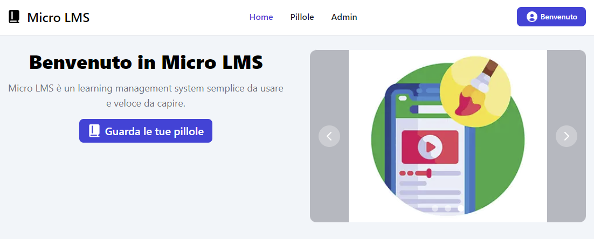

# Micro LMS

Una applicazione web costruita utilizzando [`Create T3 App`](https://create.t3.gg/).



## Prerequisiti

Per utilizzare il progetto è necessario avere installato:
- Windows 10 versione 2004 e successive o Windows 11
- [Visual Studio Code](https://code.visualstudio.com/)
- [Sottosistema di Windows per Linux (wsl)](https://learn.microsoft.com/en-us/windows/wsl/)
- una distribuzione linux per wsl (p.e. [Debian](https://apps.microsoft.com/detail/9msvkqc78pk6?hl=it-it&gl=IT))
- [Docker Desktop for Windows](https://docs.docker.com/desktop/install/windows-install/)

## Setup ambiente di sviluppo

```bash
# 1. Avviare la distro linux wsl

# 2. Clonare il progetto
git clone https://github.com/m2thiew/micro-lms.git

# 3. Stampa a video il percorso per avviare VS Code in modalità "devcontainer"
cd micro-lms/
./scripts/setup-print-code-shortcut.sh

# Esempio output:
# "%LOCALAPPDATA%\Programs\Microsoft VS Code\code.exe" --folder-uri "vscode-remote://dev-container+5c5c77736c2e6c6f63616c686f73745c44656269616e5c686f6d655c6d6d615c6d6963726f2d6c6d73/var/app"

# 4. Creare una scorciatoia sul proprio desktop impostando come "percorso" il valore ottenuto allo step 3.

# 5. Lanciare VS Code tramite la scorciatoia creata allo step 4.
```

Al primo avvio, Visual Studio Code provvederà a creare i container necessari per lo sviluppo e, una volta terminate le operazioni di setup, si connetterà automaticamente al container `micro-lms` contenente il codice sorgente del progetto

## Setup applicazione

```bash
# 1. Avviare la distro linux wsl

# 2. Collegarsi al container "micro-lms"
docker exec -it micro-lms bash

# 3. Installare le librerie npm dell'applicazione
npm install

# 4. Genera le chiavi per i token JWT dell'applicazione
npm run-script app-generate-jwt-keys

# 5. Inizializza le tabelle del database
npm run-script app-init-db

# 6. Importa il backup dei dati
npm run-script app-import-data
```

## Sviluppo e debug della applicazione

Avviando Visual Studio Code tramite la scorciatoia creata sul desktop, tutte le impostazioni e le estensioni necessarie per sviluppare il codice del progetto sono state automaticamente installate.

Per eseguire il debug del progetto è sufficiente premete il tasto `[F5]` dentro VS Code. Verrà quindi avviato il debug del server di backend, sia della finestra di navigazione frontend (verrà avviato una istanza di Google Chrome).

## Account learner per i test

Importando il backup dei dati salvato nel repository, la applicazione è inizializzata con un elenco di learner e pillole già inseriti. L'utente `admin@microlms.org` ha assegnato il ruolo di "admin" ed è quindi abilitato a creare, modificare ed eliminare tutti i learner e le pillole presenti nella applicazione.

Si riportano le credenziali di accesso utilizzabili per i test durante lo sviluppo:

| email                   | password    | ruolo   | pillole assegnate |
| :---------------------- | :---------- | :------ | :---------------: |
| admin@microlms.org      | admin       | admin   |         6         |
| luigi.verdi@hotmail.com | luigi.verdi | learner |         3         |
| mario.rossi@yahoo.com   | mario.rossi | learner |         3         |

---

Questo è un progetto di tesi per la [**Università degli Studi di Milano Statale**](https://www.unimi.it/).
